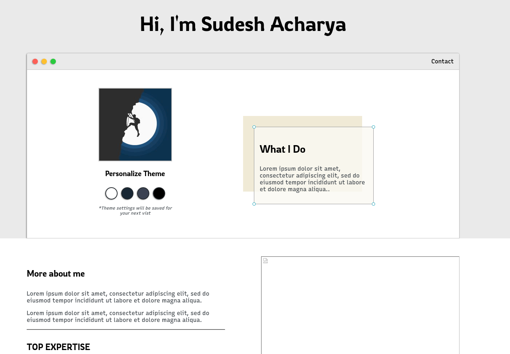
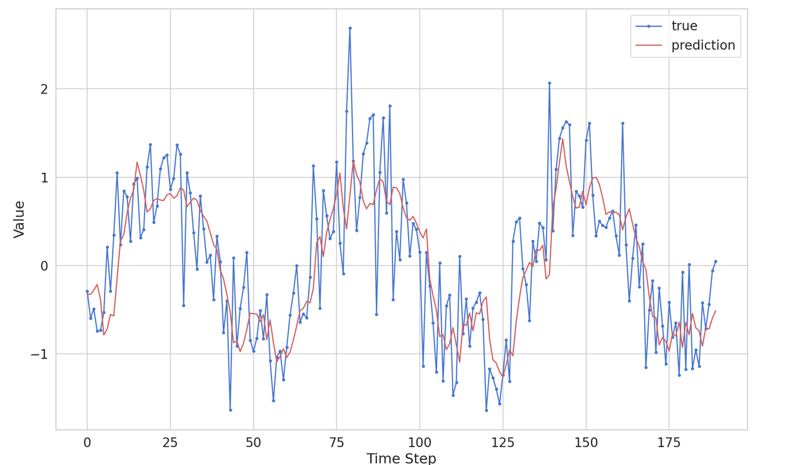
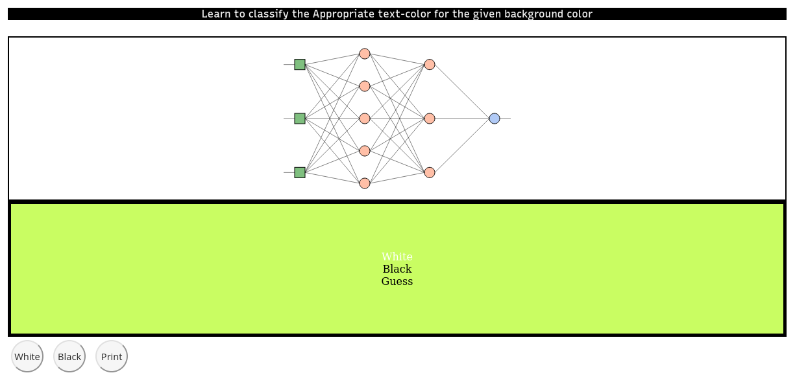
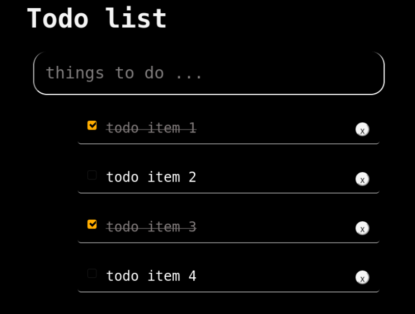

# Website Portfolio

> Introduction :man:, Academics :mortar_board:, Achievement :star2:, Expecience :computer: and Projects undertaken. 




## Instructions

```nodejs

# Install dependencies
npm install

# Start Server
node app

```

## Projects Undertaken

### 1. Classical Machine Learning on Various Datasets (ScikitLearn):

- [Regression](https://github.com/Mnpr/ClassicalML-ScikitLearn/blob/master/Implementation-ipynb/Regression.ipynb) - Linear, Multiple-Linear Regression

- [Support Vector Machine](https://github.com/Mnpr/ClassicalML-ScikitLearn/blob/master/Implementation-ipynb/SVM.ipynb) - Iris Dataset ( Linear & RBF kernel)

- [Decision Tree Classification](https://github.com/Mnpr/ClassicalML-ScikitLearn/blob/master/Implementation-ipynb/DecisionTrees/DecisionTreeClassification.ipynb) - UCI Banknote Authentication Dataset

- [Decision Tree Regression](https://github.com/Mnpr/ClassicalML-ScikitLearn/blob/master/Implementation-ipynb/DecisionTrees/DecisionTreeRegression.ipynb) -  FSU Petron Consumption Dataset

- [K-Means Clustering](https://github.com/Mnpr/ClassicalML-ScikitLearn/blob/master/Implementation-ipynb/Clustering/KMClustering.ipynb)

- [Heirarchical Clustering](https://github.com/Mnpr/ClassicalML-ScikitLearn/blob/master/Implementation-ipynb/Clustering/HeirarchicalClustering.ipynb) - Customer Segmentation Using Clustering

- [K Nearest Neighbors Classificaiton](https://github.com/Mnpr/ClassicalML-ScikitLearn/blob/master/Implementation-ipynb/KNN.ipynb) - Iris DataSet Classification

- LDA, [PCA](https://github.com/Mnpr/ClassicalML-ScikitLearn/blob/master/Implementation-ipynb/HighDimensionalExploration/Notebooks/miceProtein.ipynb) - Mice Protein data exploration and clustering

- [t-SNE, ISOMAP](https://github.com/Mnpr/ClassicalML-ScikitLearn/blob/master/Implementation-ipynb/HighDimensionalExploration/Notebooks/tSNE.ipynb) - MNIST Handwritten digits in High-dimensional manifold

- [Holdout](https://github.com/Mnpr/ClassicalML-ScikitLearn/blob/master/Implementation-ipynb/ModelSelection/Notebooks/Holdout.ipynb) - Problem associated with model evaluation using Holdout

- [Algorithm Selection](https://github.com/Mnpr/ClassicalML-ScikitLearn/blob/master/Implementation-ipynb/ModelSelection/Notebooks/AlgorithmPerformanceComparison.ipynb) - Performance Comparison ( SVM, KNN, and Logistic Regression) Iris DataSet

- [k-Fold and Nested k-Fold CV](https://github.com/Mnpr/ClassicalML-ScikitLearn/blob/master/Implementation-ipynb/ModelSelection/Notebooks/NestedCrossValidation.ipynb) - Breast Cancer Dataset Algorithm Selection( KNN, Logistic Regression, SVM, Random Forest etc.) - Performance and Learning Curve.

- [Model Selection Pipeline](https://github.com/Mnpr/ClassicalML-ScikitLearn/blob/master/Implementation-ipynb/ModelSelection/Notebooks/ModelSelectionPipeline.ipynb) - Feature Selection, Tuning, Model Evaluation and Selection

- [AIC, BIC, MDL](https://github.com/Mnpr/ClassicalML-ScikitLearn/blob/master/Implementation-ipynb/ModelSelection/Notebooks/AIC_BIC_MDL.ipynb) - Model Selection Criteria - Petrol Consumption Dataset.


### 2. [Time Series forecasting : Classical/ NeuralNetworks](https://github.com/Mnpr/TimeSeriesForecasting)



**Using :**
- Classical Techniques
- LSTM( RNNs )
- Facebook Prophet 


### 3. Web Development

#### 1. [Socialog](https://github.com/Mnpr/SociaLog)

- Social media APP
- NodeJS, MongoDB, Express, SocketIO, Passport, Auths, APIs etc.

**Todo**

- [ ] Migrate FrontEnd Ejs -> Vue | Angular
- [ ] Backend ( Reconfigure AWS) 

#### 2. [Neural Networks in Browser](https://github.com/Mnpr/portfolioWebsite)

- Implemented with portfolioWebsite
- Install Dependencies & Run Node Runtime
- >> @ http://localhost:5000/post.html



#### 3. [Elm Crud APP (Alternative to JS) | Functional Programming Language ](https://github.com/Mnpr/crudElm)



#### 4. [ Concept Implementation/ LearnBase](https://github.com/Mnpr/LearnBase-Python-R-WEB)

- Python
- R 
- HTML5, CSS3, JS, Node, MongoDB, Elm/Haskell, BrainJS, Angular, TypeScript
- Concepts ( Vue, React )

#### 5. [Blockchain Core/ API](https://github.com/Mnpr/Blockchain)

#### 6. [Portfolio Website](https://github.com/Mnpr/portfolioWebsite)

- [x] Add Themes
- [x] Add Backend
- [ ] Front ( Content, Framework)

### 4. [Neural Networks and Deep Learning](https://github.com/Mnpr/NeuralNetworks-TF-Torch)

- Numpy
- Pandas
- Matplotlib/ Seaborn
- [ ] Tensorflow/ Pytorch
  - ANN
  - RNN
  - CNN
  - AE
  - GAN

### 5. [Computer Vision ( OpenCV, Python)](https://github.com/Mnpr/ComputerVision-Python)

- Image Processing
- Video Processing
- [ ] Obect Tracking/ Detection
- [ ] Image Segmentation
- [ ] Deep Learning in CV


***

### 6. Future Projects

- [ ] Art/ Music Generation ( Variational AutoEncoders / Generative Adverserial Networks / Transformers )


### TODOs

- [ ] Database Connection
- [ ] JS based (AI addition) 

***